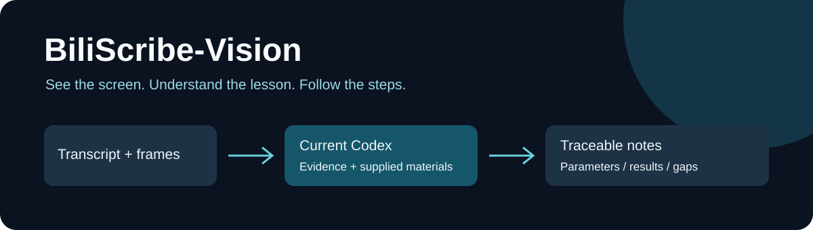
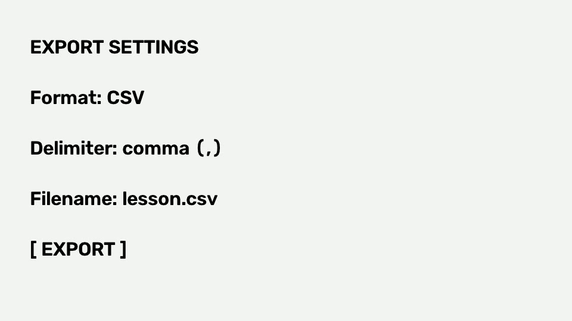

<div align="center">
  
  <h1>BiliScribe-Vision</h1>
  <p><strong>把视频画面与转录，变成能照着做的讲义。</strong></p>
  <p><a href="README.en.md">English</a> · <a href="docs/quickstart.md">快速开始</a> · <a href="examples/README.md">看示例</a> · <a href="docs/troubleshooting.md">排查问题</a></p>
  <p>Codex Skill · Python 3.11+ · GPL-3.0-or-later</p>
</div>

视频关键帧 + 同时间窗转录 → 当前 Codex 实际看图 → PPT/PDF 融合 → 讲义与操作步骤。

适合课程复习、公式与知识点整理、PPT 类教学视频和软件操作复现。讲义沿课程顺序组织，每个课堂结论保留讲次、时间与来源；课本补充和 AI 补解单独标记。

## 先看结果

“老师演示了导出”只能告诉你发生过什么。这个项目要求写清菜单入口、CSV 参数、文件名、结果和核对方法。参数只在画面出现时，也必须由当前 Codex 实际看图取得。



[查看完整示例、输入和验收边界](examples/README.md)。示例是自制合成教学场景，截图已由当前 Codex 阅读，未在真实软件中执行。不打包第三方课程或课本。

## 选择哪一版

| 需要 | Audio | Vision |
|---|---|---|
| 字幕、语音转录与来源讲义 | ✓ | ✓ |
| PPT/PDF/DOCX 文字与选章补充 | ✓ | ✓ |
| 视频关键帧联合理解 | — | ✓ |
| 画面中的公式、图表、参数与结果 | — | ✓，需图片工具 |
| 记录可执行操作步骤与缺失项 | 仅口述支持的内容 | ✓，仍需复现审查 |
| 默认下载视频画面 | 不下载 | 只在画面模式中下载 |

另一版：[BiliScribe-Audio](https://github.com/826784562/BiliScribe-Audio)。两版 Skill 名称不同，可同时安装。本项目继承 12 版的画面理解工作；公开版本采用语义版本号，当前 1.0.0。

## 安装与第一次使用

需要 Python 3.11+（推荐 3.12）、Git 和可执行 Skill 的 Codex。画面模式还需要当前 Codex 能实际读取本地图片。

```bash
git clone https://github.com/826784562/BiliScribe-Vision.git
cd BiliScribe-Vision
python install.py
```

安装器只复制源码到 Codex 的 skills 目录，不下载模型、不安装依赖、不修改其他 Skill；已有同名目录时会停止，确认后可用 --update。输出会给出实际安装路径，安装后的 Skill 不依赖仓库原位置。新开 Codex 对话，再说：

> 使用 $bili-scribe-vision，先检查并安装必要的本地依赖。
> 整理这门课：〈链接或本地转录路径〉，使用转录文字＋关键帧理解视频。
> 先确认讲次范围，再理解课程，之后结合我提供的 PPT 和选中课本。
> 操作步骤写清位置、参数、动作、预期结果和检查点，缺失就标出来。

项目使用方式：在 Codex 打开本仓库，使用 .agents/skills/bili-scribe-vision/SKILL.md。Windows 和 macOS/Linux 的依赖命令、导入转录与离线示例见 [快速开始](docs/quickstart.md)。**Python 脚本不会自动生成讲义；理解与写作发生在当前 Codex 会话中。**

## 模型、费用与数据

理解模型就是执行 Skill 的当前 Codex；没有另一个视觉 API 或视觉密钥。转写可用本地 faster-whisper 或用户配置的兼容云 ASR。两版都使用字幕/转录理解口述，未直接听取原始音频。

| 路径 | 材料发送到哪里 | 何时发生 |
|---|---|---|
| B 站获取 | 请求课程元信息、字幕或媒体 | 用户确认范围后 |
| 本地转写/材料提取 | 本机处理；首次本地 ASR 可能下载模型 | 显式安装或选择本地转写后 |
| 当前 Codex 理解 | 转录及实际读取的图片进入当前 Codex 会话 | Skill 执行时 |
| 可选云 ASR / MinerU OCR | 对应音频 / PDF 发送到所选服务 | 用户选择并授权后 |

“不另配理解 API”不表示模型理解完全离线，也不表示 Codex 或云转写免费。核心安装不包含本地 ASR，按需加 --with-asr。仅处理你有权观看/使用的内容；不绕付费墙或 DRM。原始音视频、转录、教材、凭据和课程输出默认被 Git 忽略。

## 交付与校验

```text
outputs/<course-id>/
├── course_manifest.json         # 范围、身份与顺序
├── understanding_manifest.json # 带来源的理解记录
├── 大纲.md
├── 讲义/                       # 逐讲知识与操作步骤
├── 术语表.md
├── 习题讲解.md                  # 课堂解与 AI 补解分区
└── 交付报告.md                  # 覆盖、缺失和验证程度
```

使用课本时还会生成选章清单和互补大纲。自动校验检查身份、覆盖、时间、引用与输入变化；**它不能证明语义正确、模型确实看懂图像或软件实机复现成功**。交付前还需对照原证据抽查。当前边界与改进计划见 [路线图](docs/roadmap.md)。

[查看发布前验证记录](docs/validation.md)。

## 开发与贡献

```bash
# 先按快速开始安装核心依赖，随后使用该虚拟环境的 Python
python -m unittest discover -s tests -v
python .agents/skills/bili-scribe-vision/scripts/test_pipeline.py -v
```

CI 配置覆盖 Windows / Ubuntu 与 Python 3.11 / 3.12，离线检查不下载真实课程或 ASR 模型。工作流首次在 GitHub 成功运行前不宣称 CI 已通过。欢迎提供可公开复现的错误和授权示例，见 [贡献指南](CONTRIBUTING.md)、[行为准则](CODE_OF_CONDUCT.md)、[安全说明](SECURITY.md)。

## 许可证与致谢

GPL-3.0-or-later，保留原始 [LICENSE](LICENSE) 与 [NOTICE](NOTICE)。项目源自 BiliScribe / bilibili-persona 工作流，复用与改编来源见 NOTICE（lineage-skill、lecture-to-notes）。第三方课程和课本不因本软件开源而取得再分发许可。
